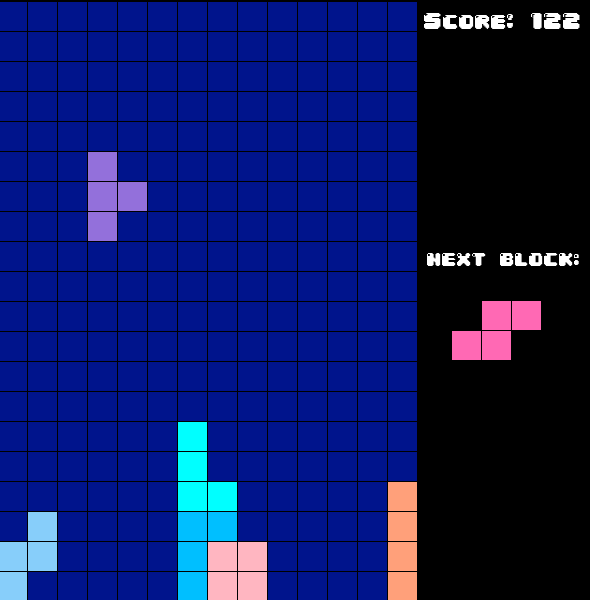

# OT_Tetris

Na danom repozitáre sa nachádza implementácia prototypu hry v Pygame, ktorá bola vytvorená ako projekt k predmetu Objektové technológie. Na danej hre boli prezentované podstatné herné funkcionality.

**Autor:** Daniel Turančík

**Vybraná téma:** One level, but constantly changing - jeden level, ale neustále sa mení
 
## 1. Úvod 

Hra je verná originálnemu Tetrisu, kde hráč musí usporiadať padajúce bloky tak, aby vytvoril kompletné riadky, ktoré následne zmiznú. Hráč sa snaží dosiahnuť čo najvyššie skóre.

### 1.1 Inšpirácia

Tetris je ikonická logická hra, v ktorej hráč usporadúva padajúce bloky tak, aby vytvoril kompletné riadky. Herná mechanika vyžaduje rýchle myslenie a priestorovú predstavivosť 

### 1.2 Herný zážitok

Cieľom hry je dosiahnuť čo najvyššie skóre postupným usporadúvaním blokov. Hráč sa snaží zabrániť tomu, aby sa hracia plocha zaplnila blokmi, čo vedie ku koncu hry. Postupne sa zvyšuje rýchlosť hry, čím sa zvyšuje náročnosť.

### 1.3 Vývojový softvér
 - **Pygame-CE:** Zvolený programovací jazyk a knižnica pre implementáciu.
 - **PyCharm 2024.3.2:** Vybrané IDE na vývoj hry.

## 2. Koncept

### 2.1 Prehľad hry

Hráč sa snaží usporiadať náhodne generované bloky tak, aby vytvoril kompletné riadky. Po vytvorení kompletného riadku sa tento riadok odstráni a hráč získa body.

### 2.2 Základné mechaniky
 - **Pohyb a rotácia blokov:** Hráč môže posúvať bloky doľava, doprava a otáčať ich.
 - **Tvorba kompletných riadkov:** Riadky sa odstraňujú, keď sú úplne vyplnené.

### 2.3 Návrh tried
- ``main`` - Hlavný súbor, spúšťa hru a inicializuje herné komponenty.
- ``game`` - Trieda riadiaca celkový chod hry, obsahuje hlavné herné mechaniky.
- ``grid`` - Trieda spravujúca hraciu plochu, detekuje a odstraňuje kompletné riadky.
- ``block`` - Trieda predstavujúca základný herný blok
- ``blocks`` - Obsahuje definície tvarov a farieb blokov.
- ``position`` - Jednoduchá trieda uchovávajúca súradnice bloku na gride.
- ``colors`` - Trieda definujúca farby blokov a pozadia.

  
   
  <em>Obrázok z hry Tetris</em>

